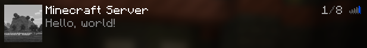

# Magma Server

### A basic implementation of the Minecraft Server Protocol in TypeScript

Currently only supports the Server List Ping packet

To install dependencies:

```bash
bun install
```

To run:

```bash
bun run src/main.ts
```

Add `localhost:25565` to the server list



This project was created using `bun init` in bun v1.0.16. [Bun](https://bun.sh) is a fast all-in-one JavaScript runtime.
